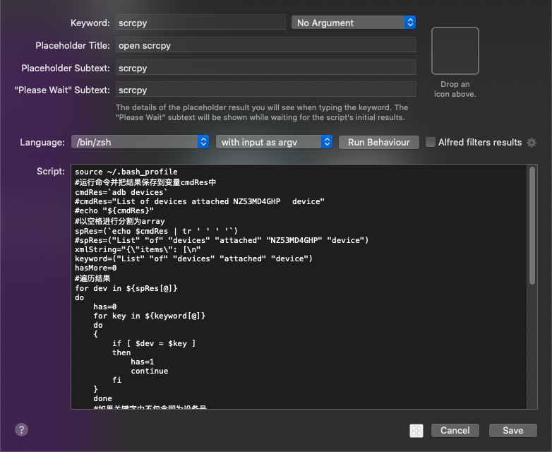
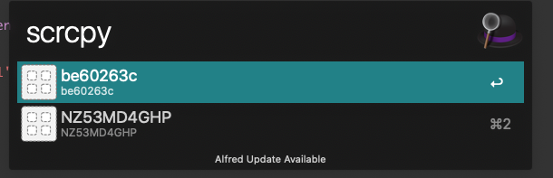
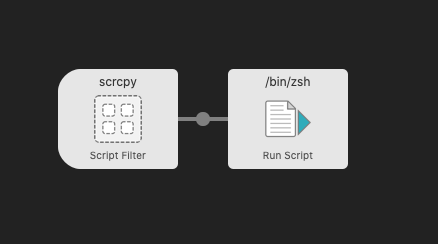
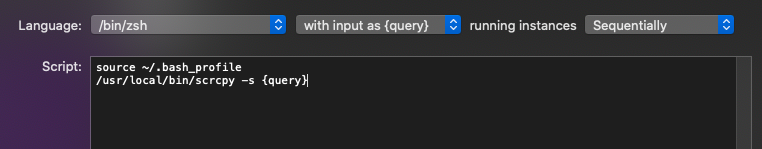

# Alfred Workflow实现scrcpy快捷启动

[Alfred](https://www.alfredapp.com/)是MacOS上一个非常强大的效率工具，通过它可以实现很多方便的快捷功能。[scrcpy](https://github.com/Genymobile/scrcpy)是一款开源的安卓设备投屏操作软件，质量很好且免费。但是在存在多个设备的情况下使用不是很方便，需要先运行`adb devices`查看设备对应的序列号，复制后再用`scrcpy -s 序列号`才能启动对应的设备，有了Alfred就方便很多了，可以使用它的Workflow功能很方便的实现多个设备的选择和scrcpy的启动。网上的相关文章不多，讲也没有讲得很清楚，随便记录一下。

## 实现Workflow

选择 script filter类型，基本设置如图：




执行脚本如下：

```shell
source ~/.bash_profile
cmdRes1=`adb devices -l`
modelResult=(`echo $cmdRes1 | grep -E -o "model:\S+"`)
# echo "${modelResult}"
snResult=(`echo $cmdRes1 | grep -E -o "(\S+)\s+device usb:"`)
#echo "${snResult}"
length=${#modelResult}
# echo "${length}"
xmlString="{\"items\": [\n"
snIndex=0
for (( k=0; k <= $length; k++ ))
do
    if [ -n "${modelResult[$k]}" ]
    then
        mod=${modelResult[$k]}
        mod=(`echo $mod | tr ':' ' '`)
        mod="${mod[1]}"
        if [ "$snIndex" -gt '0' ]; then
	        xmlString+=","
        fi
        dev=${snResult[$snIndex]}
        thisXmlString="{
        \"uid\": \"$dev\",
        \"type\": \"file\",
        \"title\": \"$mod\",
        \"subtitle\": \"$dev\",
        \"arg\": \"$dev\",
        \"autocomplete\": \"$dev\"
    }\n"
	# Append this process's XML string to the global XML string.
	xmlString+=$thisXmlString
    snIndex+=3
    fi
done
xmlString+="]}"
# xmlString="{\"items\": [
# { \"uid\": \"NZ53MD4GHP\", \"type\": \"file\", \"title\": \"NZ53MD4GHP\", \"subtitle\": #\"NZ53MD4GHP\", \"arg\": \"NZ53MD4GHP\", \"autocomplete\": \"NZ53MD4GHP\" }
# ]}"
#最后将结果输出,就可以在列表中选择了
echo -e $xmlString

```

需要注意的点是:

1. 不要在脚本中输出非结果json外的信息，因为输出都被当为结果了，如果不是标准的json或者xml就会解析出错。构建输出标准的结果就能实现列表的展示和选项的选择了。
2. zsh和bash的效果是不一样的,上面后面修改过的脚本在zsh下就不能生效.



选择的结果会被传入后续的步骤中，这里也选择执行script：





上一步选择的结果被赋值给query变量，直接引用就好了。至此就实现了scrcpy的设备快速选择和启动。用起来也是非常的方便。


## 打包下载

旧版本: https://wwx.lanzoux.com/iTq7njsq7gb
新版本: [https://wwx.lanzoux.com/iRsI2k3lkih](https://wwx.lanzoux.com/iRsI2k3lkih)
模式都是相同的，根据这个可以实现更多有趣实用的功能。

