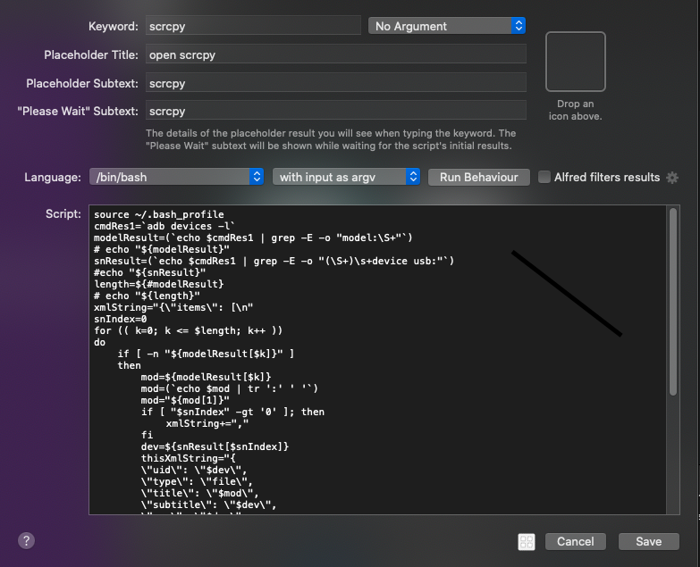
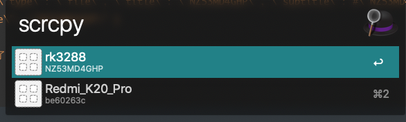

# Alfred Workflow实现scrcpy快捷启动

[Alfred](https://www.alfredapp.com/)是MacOS上一个非常强大的效率工具，通过它可以实现很多方便的快捷功能。[scrcpy](https://github.com/Genymobile/scrcpy)是一款开源的安卓设备投屏操作软件，质量很好且免费。但是在存在多个设备的情况下使用不是很方便，需要先运行`adb devices`查看设备对应的序列号，复制后再用`scrcpy -s 序列号`才能启动对应的设备，有了Alfred就方便很多了，可以使用它的Workflow功能很方便的实现多个设备的选择和scrcpy的启动。网上的相关文章不多，讲也没有讲得很清楚，随便记录一下。

## 实现Workflow

选择 script filter类型，基本设置如图：




执行脚本如下：

```shell
source ~/.bash_profile
#运行命令并把结果保存到变量cmdRes中
cmdRes=`adb devices`
#cmdRes="List of devices attached NZ53MD4GHP	device"
#echo "${cmdRes}"
#以空格进行分割为array
spRes=(`echo $cmdRes | tr ' ' ' '`)
#spRes=("List" "of" "devices" "attached" "NZ53MD4GHP" "device")
xmlString="{\"items\": [\n"
keyword=("List" "of" "devices" "attached" "device")
hasMore=0
#遍历结果
for dev in ${spRes[@]}
do
    has=0
    for key in ${keyword[@]}
    do
    {
        if [ $dev = $key ]
        then
            has=1
            continue
        fi
    }
    done
    #如果关键字中不包含即为设备号
    if [ "$has" -eq '0' ]; then
     #  echo $dev
        if [ "$hasMore" -eq '1' ]; then
	        xmlString+=","
        fi
    hasMore=1
    thisXmlString="{
        \"uid\": \"$dev\",
        \"type\": \"file\",
        \"title\": \"$dev\",
        \"subtitle\": \"$dev\",
        \"arg\": \"$dev\",
        \"autocomplete\": \"$dev\"
    }\n"
	# Append this process's XML string to the global XML string.
	xmlString+=$thisXmlString
    fi
done

xmlString+="]}"
# xmlString="{\"items\": [
# { \"uid\": \"NZ53MD4GHP\", \"type\": \"file\", \"title\": \"NZ53MD4GHP\", \"subtitle\": #\"NZ53MD4GHP\", \"arg\": \"NZ53MD4GHP\", \"autocomplete\": \"NZ53MD4GHP\" }
# ]}"
#最后将结果输出,就可以在列表中选择了
echo -e $xmlString
```

需要注意的点是，不要在脚本中输出非结果json外的信息，因为输出都被当为结果了，如果不是标准的json或者xml就会解析出错。构建输出标准的结果就能实现列表的展示和选项的选择了。



选择的结果会被传入后续的步骤中，这里也选择执行script：


上一步选择的结果被赋值给query变量，直接引用就好了。至此就实现了scrcpy的设备快速选择和启动。用起来也是非常的方便。


## 打包下载

https://wwx.lanzoux.com/iTq7njsq7gb

模式都是相同的，根据这个可以实现更多有趣实用的功能。

