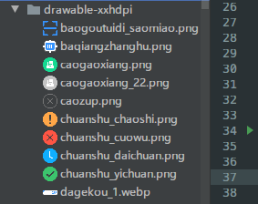

# Android Drawable Preview插件适配Android Studio4.1版发布

[Android Drawable Preview](https://plugins.jetbrains.com/plugin/10730-android-drawable-preview)是一个在安卓开发中非常有用的AS/IDEA插件,可以将drawable资源文件的icon替换成内容的预览图,达到不需要打开资源文件,快速预览内容的功能,实在是非常的方便快捷,让开发工作更加的愉悦.

使用之前:


使用之后:




便利程度自然不用多说,是我一直使用的重要插件之一.

可是好景不长,前几天AS4.1正式版发布了,虽然新功能我不一定都用到,但是就算为了intellij平台的更新,所以我向来都是用最新版AS的,升级后一些插件报错了:

```
Plugin "Kotlin Code Sorter" is incompatible (supported only in IntelliJ IDEA).
Plugin "Android Drawable Preview" is incompatible (supported only in IntelliJ IDEA).
```

这是因为intellij平台更新了,对插件的配置有了一些要求,没有及时跟进升级的插件都会得到这个错误提示且不再兼容.查看[Android Drawable Preview插件作者的GitHub](https://github.com/mistamek/Android-drawable-preview-plugin)上次更新已经是2年前,作者也不是很活跃,不知道什么时候才能更新,可是离开这个这个插件势必会影响到开发效率,又舍不得回退AS到4.0,恰好我也有一点点插件开发经验,于是fork仓库,对AS4.1版本进行了小小的适配.目前已经提交pull request到源仓库,如果原作者采纳的话,才会打包发布到jetbrains的插件仓库,AS上的老版本才能得到更新提示,如果现在就想用新版的话,可以在[我fork的仓库](https://github.com/longforus/Android-drawable-preview-plugin/releases)进行下载后手动安装:

- **手动安装:**
  - 下载[`最新发布的插件包`][latest-release] > <kbd>File</kbd> ><kbd>Preferences(Settings)</kbd> > <kbd>Plugins</kbd> > <kbd>Install plugin from disk...</kbd>

#### 其他相同问题的插件

如果有其他插件也出现同样的问题,而作者还没有更新的话,可以尝试强行修改:

1. 到`C:\Users\longforus\AppData\Roaming\Google\AndroidStudio4.1\plugins`目录下找到对应插件的jar包.

2. 比如`C:\Users\longforus\AppData\Roaming\Google\AndroidStudio4.1\plugins\kotlincodesort\lib\kotlincodesort-1.2.2.jar`(这个是比如哈,我的插件已经更新了的)用压缩软件打开.

3. 打开jar包内的`kotlincodesort-1.2.2.jar\META-INF\plugin.xml`:

    ```xml
    <idea-plugin>
      <version>1.2.2</version>
      <change-notes>
          Adapter Android Studio 4.1
          </change-notes>
      <id>com.longforus.kotlincodesorter</id>
      <name>Kotlin Code Sorter</name>
      <vendor email="yxq.longforus@gmail.com" url="https://github.com/longforus">longforus</vendor>
      <description>
       	......
        </description>
      <idea-version since-build="192"/>
      <depends>org.jetbrains.kotlin</depends>
      <depends>com.intellij.modules.platform</depends>//添加这一行
      <extensions defaultExtensionNs="com.intellij">
        <applicationConfigurable instance="com.longforus.kotlincodesorter.config.ConfigComponent"/>
      </extensions>
      <actions>
    	......
      </actions>
    </idea-plugin>
    
    ```

4. 保存,重启AS看是否能使用.**这种方法只适用于不涉及API改变的情况,如果插件有使用已经删除的API等情况的话,用起来也会报错的,不能保证后续功能的正常使用**,还是建议通知原作者更新.

#### 我其他的小插件:

- MvpAutoCodePlus   mvp模板代码生成 https://github.com/longforus/MvpAutoCodePlus
- Kotlin Code Sorter   kotlin代码排序  https://github.com/longforus/KotlinCodeSorter
- adb-idea插件升级版  ADB IDEA插件增强版  https://blog.csdn.net/longforus/article/details/83046562

如果对你有用,欢迎star.

[latest-release]: https://github.com/longforus/Android-drawable-preview-plugin/releases