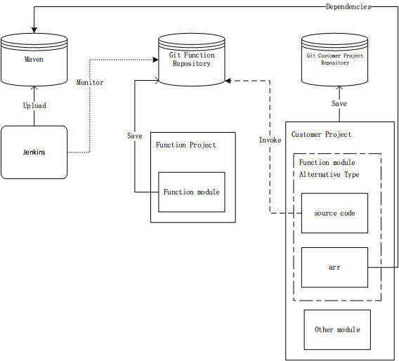
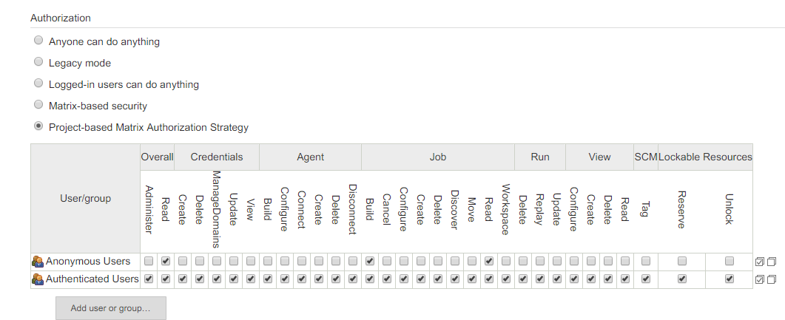

# Android模块化项目模块保存及持续集成方案

## 分析

在使用模块化开发的过程中,模块的复用面临着同步的问题,既在A项目中修改了am模块,如何把修改同步到同样也在使用am模块的B项目中?在之前的模块化开发中这个问题是没有很好的解决的.在多个项目工程中通过复制,存在多份同一模块的实例.且分布在每个项目的svn仓库中,在某工程中修改am模块后只能通过拷贝的方法,把修改的代码复制到另一项目工程的am模块中,非常低效而且很容易出错.解决方案有2个:

1.  使用到am模块的项目工程不直接引用am模块的源代码,am模块的源码只在模块开发项目中存在一份,(功能模块在单独的项目中开发,因为需要做到同级别的模块间充分解耦,所以这样功能模块的代码隔离是必要且必须的,业务模块?),开发完成后,上传到maven私服给所有需要使用这个模块的项目提供依赖.

    -   优点:
        -   功能模块间的代码完全解耦.
        -   不能轻易修改实现代码.这即是优点也是缺点.
        -   使用aar格式依赖,编译速度得到很大提高.
    -   缺点:
        -   在功能模块尚未稳定的情况下,如需要修改功能模块的代码,需要另外到模块开发工程中,修改功能实现后,重新上传到maven,使用功能模块的工程同步更新.步骤较为冗长,且功能开发工程的测试用例和实际使用工程的测试用例很大可能存在差异.导致测试结果的不统一,提高二次修改的几率.在功能模块的初期版本和功能迭代期间.效率会比较低.

    这是目前使用的方案.

2.  使用git管理功能模块源码及使用功能模块的客户工程.功能模块仍旧使用单独的模块开发,并使用单独的git仓库保存.使用git的子模块功能引用添加该仓库为客户工程的子模块.功能模块的仓库只存在一份.多个客户项目共同使用,在子模块需要变更的时候直接修改客户工程中的子模块源码.开发完成后上传.子模块源码的修改会提交到子模块自己的仓库中,其他引用的客户工程更新即可.

    -   优点:

        -   功能模块修改效率高.一次修改多客户同步.

    -   缺点:

        -   客户工程仍旧需要编译子模块的源码.在模块数过多的时候,编译流程变长.

        -   可以方便的修改功能模块的源代码,在不能严格要求的情况下,容易产生"不好的修改".封闭性较弱.

        -   多客户工程的共同修改,可能会导致功能模块的代码冲突,冗余.虽然可以通过分支进行管理,但是学习成本和管理复杂度提高.


## 解决方案

以上方案各有优缺点.最好的方案应该是取其优者而从之.功能模块和客户工程仍旧使用git进行管理.但是客户工程一开始并不直接依赖功能模块的源代码.而是依赖现有功能模块的aar,在需要对现有功能模块进行修改的时候才动态的导入功能模块源码,进行修改,测试.一旦修改完成,仍旧将功能模块打包上传,修改客户工程依赖新版本的功能模块aar.充分保证编译效率的同时,减少功尽量能模块迭代期间造成的非预期BUG.在这一过程中,还会结合jenkins持续集成系统,在子模块修改完成后,push到仓库后触发,jenkins的构建,自动提高功能模块aar版本,构建完成后自动上传到maven私服,客户工程刷新依赖,获取到最新版的功能模块aar.



## 实现细节

### 搭建本地Git服务器

这里使用[Gitlab](https://about.gitlab.com/install/),安装到docker,配置一下就好了.有2点需要注意:

1.  端口映射:参照https://www.jianshu.com/p/d707f70c60d2
2.  添加hook不能使用本地地址,报 Url is blocked: Requests to the local network are not allowed :需要使用初始的admin@example.com登录,Settings > Outbound requests 将Allow requests to the local network from hooks and services勾选.

### 提交现有功能模块到Git

1.  创建功能模块的git仓库,仓库名最好和模块名相同,为了保持包装工程的配置不变化.clone到一个空文件夹.

2.  从现有的svn服务器重新checkout Function Project,删除.svn文件夹, cut对应的Function module到clone的git文件夹中.修改module的build.gradle文件,包含

3.  commit push

4.  所有模块push完成后,创建Function Project的git仓库,同样的方法处理Function Project剩余的文件.

5.  在Function Project的git版本根目录,添加子模块.

    ```powershell
    git submodule add 功能模块仓库地址 功能模块相对路径
    ```

    注意这里的路径需要与之前项目结构中的路径相同.添加完成后,根目录会生成`.gitmodules`文件,保存着子模块信息,需要添加到版本管理中.like this:

    ```shell
    [submodule "otherLib/addresswheel"]
    	path = otherLib/addresswheel
    	url = https://admin@192.168.2.39:8443/r/addresswheel.git
    ```

    子模块的详细操作见:https://git-scm.com/book/zh/v2/Git-%E5%B7%A5%E5%85%B7-%E5%AD%90%E6%A8%A1%E5%9D%97

6.  后续子模块和外部工程的修改都会提交到对应的仓库中,子模块也可供多处使用.

7.  要实现子模块的Jenkins构建的话,需要对模块的build.gradle文件进行包装.

### 搭建Jenkins服务器

下载地址:https://pkg.jenkins.io/redhat-stable/

安装必要插件,需要注意的是,远程触发构建不成功的问题.是权限认证问题,Configure Global Security设置如下:



远程触发使用插件:[[GitLab Plugin](https://wiki.jenkins.io/display/JENKINS/GitLab+Plugin)],名字相关的都安装.

执行组件模块的`uploadArchives`即可完成构建上传.

