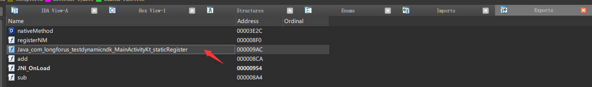
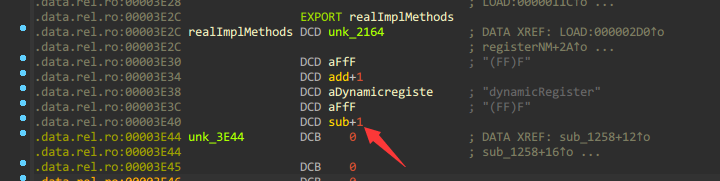
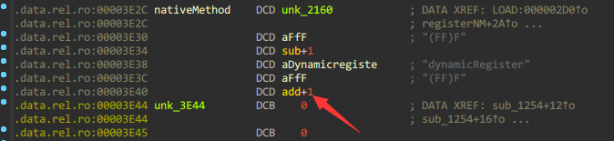

# JNI的简单动态注册及反编译查看

**给我搞晕了,国内的文章说的动态注册和[国外的文章](https://valsamaras.medium.com/tracing-jni-functions-75b04bee7c58)说的动态注册恰恰相反,JNI的文档里面也没看出来,我也确定不了到底那种是动态,那种是静态,感觉上国内文章的说法更符合直觉,就这么用吧.**

在常规的JNI静态注册中,用IDA打开对应的so(shared object)库后就能直接在Exports选项卡中找到对应的方法入口:

```kotlin
external fun staticRegister(f1:Float,f2:Float):Float
```

```c

JNIEXPORT jfloat JNICALL
Java_com_longforus_testdynamicndk_MainActivityKt_staticRegister(JNIEnv *env, jclass clazz, jfloat f1, jfloat f2) {
    return f1 + f2;
}
```



比较容易被找到切入点,除了静态注册这种方法外,还有一种动态注册的方式,相对来说可以隐秘一些,增加逆向难度.

## 实现

### kt

```kotlin
//as这里会爆红:Cannot resolve corresponding JNI function Java_com_longforus_testdynamicndk_MainActivityKt_dynamicRegister.  不用生成,不用处理
external fun dynamicRegister(f1:Float,f2:Float):Float
```

### JNI

#### CMakeLists.txt

```makefile
cmake_minimum_required(VERSION 3.10.2)
project("cppjni")
add_library( # Sets the name of the library. 需要和System.loadLibrary("cppjni")一致
        cppjni
        # Sets the library as a shared library.
        SHARED
        # Provides a relative path to your source file(s). 不能每个文件都要手动来这里加吧?那也太麻烦了
        jisuan.h
        jisuan.c
        )

find_library( # Sets the name of the path variable.
        log-lib
        log)

target_link_libraries( # Specifies the target library.
        cppjni
        # Links the target library to the log library
        # included in the NDK.
        ${log-lib})
```

#### jisuan.h

```c
#include <jni.h>
//定义真正的实现功能的方法
jfloat add(JNIEnv* env,jclass obj,jfloat f1,jfloat f2);
jfloat sub(JNIEnv* env,jclass obj,jfloat f1,jfloat f2);

const JNINativeMethod realImplMethods[] = {
        {"f2f","(FF)F",(void *)sub},
    	//external fun name,signature,真实实现的方法指针
        {"dynamicRegister","(FF)F",(void *)add}//注册到kotlin定义的external fun
};

jint registerNM(JNIEnv* env);
```

#### jisuan.c

```c
#include "jisuan.h"
//实际实现方法
jfloat add(JNIEnv *env, jclass obj, jfloat f1, jfloat f2) {
    return f1 + f2;
}
jfloat sub(JNIEnv *env, jclass obj, jfloat f1, jfloat f2) {
    return f1 - f2;
}

//动态注册方法到env
jint registerNM(JNIEnv *env) {
    jclass clazz = (*env)->FindClass(env, "com/longforus/testdynamicndk/MainActivityKt");
    jint result = (*env)->RegisterNatives(env, clazz, realImplMethods, sizeof(realImplMethods) / sizeof(realImplMethods[0]));
    if (result != JNI_OK) {
        return JNI_ERR;
    }
    return JNI_OK;
}

//该so库在被load的时候的会回调,注意要返回JNI_VERSION否则会报错
JNIEXPORT jint JNI_OnLoad(JavaVM *vm, void *reserved) {
    JNIEnv *env;
    (*vm)->GetEnv(vm, (void **) &env, JNI_VERSION_1_6);
    registerNM(env);
    return JNI_VERSION_1_6;
}

//传统的静态注册
JNIEXPORT jfloat JNICALL
Java_com_longforus_testdynamicndk_MainActivityKt_staticRegister(JNIEnv *env, jclass clazz, jfloat f1, jfloat f2) {
    return f1 + f2;
}
```

## 对比

使用动态注册native方法后就不能在Exports中找到本来静态注册时存在的`dynamicRegister`了.但是根据Exports中暴露的`JNI_OnLoad`方法,F5查看伪代码,还是能找到一些端倪:

```c
jint JNI_OnLoad(JavaVM *vm, void *reserved)
{
  int v3; // [sp+18h] [bp-10h] BYREF

  (*vm)->GetEnv(vm, (void **)&v3, 65542);
  j_registerNM(v3);//这里引用了注册的方法
  return 65542;
}


int __fastcall registerNM(int a1)
{
  int v1; // r0
  int v4; // [sp+14h] [bp-Ch]
  	//这里暴露了类名
  v1 = (*(int (__fastcall **)(int, const char *))(*(_DWORD *)a1 + 24))(a1,"com/longforus/testdynamicndk/MainActivityKt");
    //直白的变量名 realImplMethods 也有点暴露意图
  if ( (*(int (__fastcall **)(int, int, void **, int))(*(_DWORD *)a1 + 860))(a1, v1, &realImplMethods, 2) )
    v4 = -1;
  else
    v4 = 0;
  return v4;
}

//导入JNIEvn后
int __fastcall registerNM(_JNIEnv *a1)
{
  jclass v1; // r0
  int v4; // [sp+14h] [bp-Ch]
    //还是直接暴露了意图,知道这里有动态注册了
  v1 = a1->functions->FindClass(a1, "com/longforus/testdynamicndk/MainActivityKt");
  if ( a1->functions->RegisterNatives((JNIEnv *)a1, v1, (const JNINativeMethod *)&realImplMethods, 2) )
    v4 = -1;
  else
    v4 = 0;
  return v4;
}
```

双击`realImplMethods`进入后:



- 动态注册的函数一般会在`.data.rel.ro.local`或data中, Ctrl+s打开segment表 找到`.data.rel.ro.local `这个段里面放的是动态注册的函数.上图中正是data.rel.ro表

直接就发现了真实做实现的`sub`指针,而且可以双击进入:

```c
float __fastcall sub(int a1, int a2, float a3, float a4)
{
  return a3 - a4;
}
```

修改`dynamicRegister`的真实实现为`add`后,再次反编译:



直接就变成了add.


## 总结

目前了解到的这个简单的动态注册相对于静态注册,安全性有一点的提升,如果使用模糊的命名,项目够大的话,安全性应该能再提升一些.

