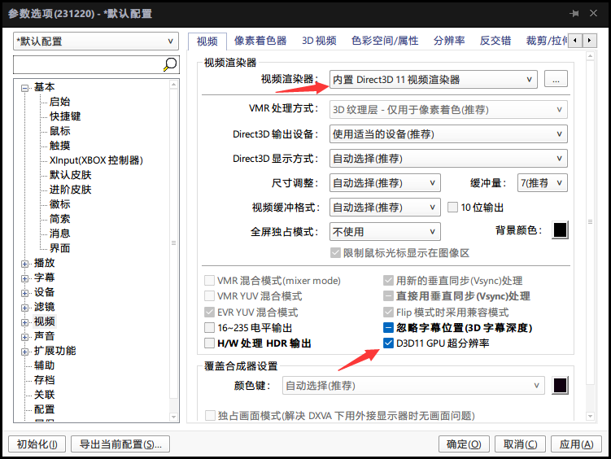
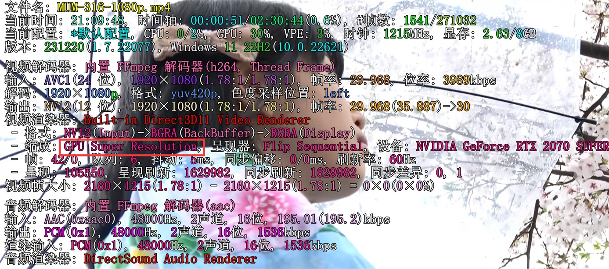

# RTX20系开启超分辨率

  我的显卡是2070s现在也支持了超分辨率,根据网上的教程一通折腾后发现了不少的坑,记一下.希望有缘人可以少走点弯路.

机器配置如下:

```text
[CPU]
CPU #1: 3600MHz, AMD Ryzen 7 3700X 8-Core Processor             , AMD64 Family 23 Model 113 Stepping 
Instruction set: MMX MMXEXT MMX2 SSE SSE2 SSE3 SSSE3 SSE4 SSE42 AVX AVX2 FMA3 CMOV BMI1 BMI2 

[OS]
Version: Windows 11 22H2(10.0.22621)
Bits: Native 64
DirectX: 9.0c(4.09.00.0904)
Direct3D 9Ex: OK

[VGA]
VGA #0: NVIDIA GeForce RTX 2070 SUPER, Generic PnP Monitor, 2160×3840, \\.\DISPLAY1
VGA #1: NVIDIA GeForce RTX 2070 SUPER, Generic PnP Monitor, 2560×1080, \\.\DISPLAY2

[Memory]
Used: 11.6GB(36%)
Total Physical: 31.9GB
Avail Physical: 20.3GB
Total Page: 36.7GB
Avail Page: 15.2GB
Total Virtual: 128TB
Avail Virtual: 128TB
Avail Extended Virtual: 0Byte

```

## 安装

1. 先升级显卡驱动到新版本,我这里是546.33 升级后在nv控制面板->调整视频图像设置,里面就有超分辨率选项了,勾上保存,质量不用选很高,我开始选4,在运行成功后,播放一个视频GPU占用会达到70%,功耗过高了,没有必要,后来改为2.
2. 网上说要装`mpc-videorenderer-rtx1.1-4e2e160`来实现本地资源的超分辨率,实测后发现potPlayer不需要.

## 配置

### 浏览器

1. chrome最新版直接就可以生效了.
2. edge的话需要配置一下才可以生效:
    - 在edge的设置中搜索找到`使用硬件加速(如可用)` 并勾选,重启edge生效.
    - 在地址栏输入[edge://flags/](edge://flags/),搜索找到`Microsoft Video Super Resolution`,选Enabled,保存重启生效.

### 本地视频播放器

1. MPC-BE播放器选择`MPC视频渲染器`后就可以开启超分辨率,但是我觉得MPC-BE播放器不好用,而且在我电脑上放着放着会闪退.

2. potPlayer(版本:1.7.22077)经过实测后,发现不用像网上说的装`mpc-videorenderer-rtx1.1-4e2e160`,直接选内置D3D11适配渲染器,然后勾选下方的`D3D11 GPU超分辨率`即可开启.

    

    默认按键下,按TAB键potPlayer可以显示OSD信息:

    

    如果缩放这里显示GPU Super Resolution,那就开启成功了,GPU占用比未开启会有明显的提升,**切记测试的时候,选择分辨率低些的视频,播放窗口要拉得超过视频原分辨率才会开启超分辨率**

