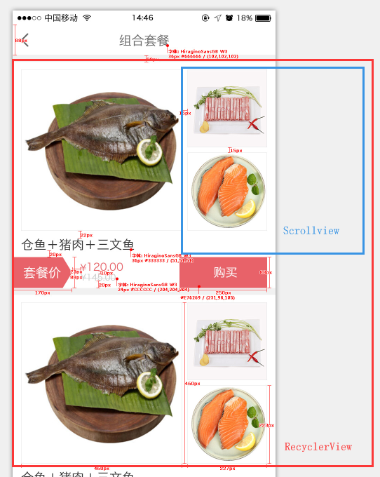

# RecyclerView的item中嵌套Scrollview的滑动冲突解决

## 场景



外层是一个RecyclerView **rv** ,每个Item中又有一个可以上下滑动的Scrollview **sv**,这种设计是比较少见和脑残的.内外层肯定会造成滑动冲突,刚刚编码完成的时候表现就是,内部的 sv 无法滑动. 但是因为H5已经实现,最近也不是很忙.而且对touchEvent的传递上不是非常的了解.就尝试着研究了一下.

在网上没有找到合适的指导方案.百度出来几乎都是Scrollview内部嵌套RecyclerView的问题.尝试自己解决.

## 尝试

1. 修改内部的Scrollview为NestedScrollView,当然是无效的.
2. 设置`sv.requestDisallowInterceptTouchEvent(true); ` 意图请求父容器不拦截touchEvent,在这里sv的父容器是这个item的rootView,在不做处理的情况下,这个rootView也是接收不到touchEvent的.因为上层根本就没有传进来.
3. 还有很多尝试,很杂也不太记得了.

## 解决方法

1. rv addOnItemTouchListener 监听touchEvent获取event坐标点,给ViewHolder判断是否请求不拦截.

   ```kotlin
    rv.addOnItemTouchListener(object : RecyclerView.OnItemTouchListener {
               override fun onTouchEvent(rv: RecyclerView?, e: MotionEvent?) {

               }

               override fun onInterceptTouchEvent(rv: RecyclerView?, e: MotionEvent?): Boolean {
                   if (e != null) {
                       //找到被点击位置的item的rootView
                       val view = rv?.findChildViewUnder(e.x, e.y)
                       if (view != null) {
                           //通过rootView找到对应的ViewHolder
                           val holder = rv.getChildViewHolder(view) as CombineAdapter.ViewHolder
                           //由ViewHolder决定要不要请求不拦截,如果不拦截的话event就回一路传到rootView中.否则被rv消费.
                           rv.requestDisallowInterceptTouchEvent(holder.isTouchNsv(e.rawX, e.rawY))
                       }
                   }
                   return false
               }

               override fun onRequestDisallowInterceptTouchEvent(disallowIntercept: Boolean) {

               }

           })
   ```

   ​


2. 判断event坐标点是否在sv范围内:

   ```java
       /**
            *
            * @param x event的rowX
            * @param y event的rowY
            * @return 这个点在不在sv的范围内.
            */
           public boolean isTouchNsv(float x,float y) {
               int[] pos = new int[2];
               //获取sv在屏幕上的位置
               mall_nsv.getLocationOnScreen(pos);
               int width = mall_nsv.getMeasuredWidth();
               int height = mall_nsv.getMeasuredHeight();
               return x >= pos[0] && x <= pos[0] + width && y >= pos[1] && y <= pos[1] + height;
           }
   ```

   ​

这样在滑动位置处于sv上的时候,event就被传到了sv中,触发sv的滑动.不在sv上的时候不做处理,触发rv的滑动,初步成功.


因水平有限,文中难免出现错误,欢迎交流,斧正.