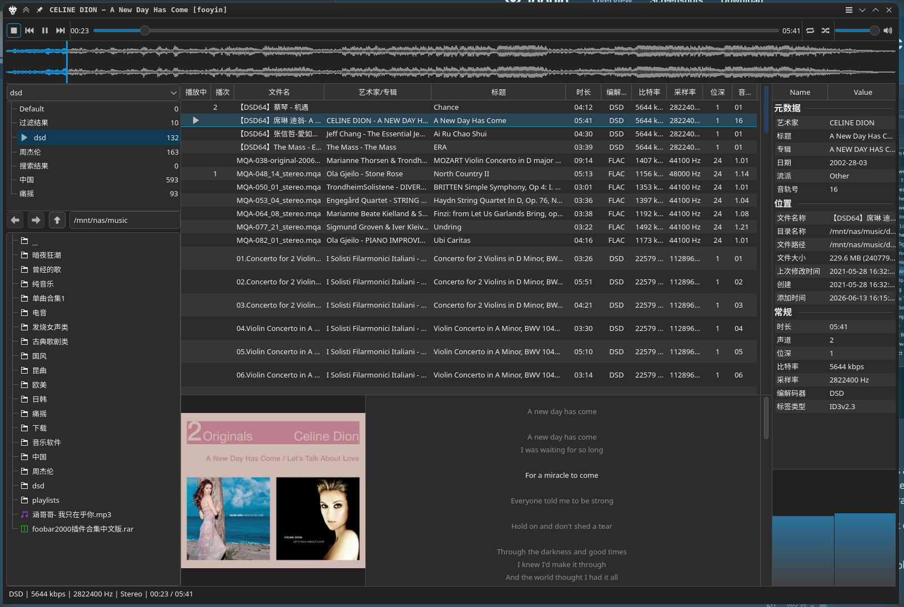

# linux上播放音乐的终极解决方案.

最近主要日常使用改为了kubuntu26.04,但是在这个系统上听歌经过了一翻摸索才达到但在对我来说基本完美的解决方案,记录一下.

听歌的DAC设备是SMSL su 9,用USB连接:
```sh
🕙17:01:27 ~
❯ lsusb
Bus 001 Device 096: ID 152a:85dd Thesycon Systemsoftware & Consulting GmbH SMSL USB AUDIO

18:42:45 ~
❯ wpctl status
PipeWire 'pipewire-0' [1.6.2, void@void-metacube, cookie:2558548640]
└─ Clients:
33. plasmashell                         [1.6.2, void@void-metacube, pid:3396]
34. WirePlumber                         [1.6.2, void@void-metacube, pid:1723162]
35. xdg-desktop-portal                  [1.6.2, void@void-metacube, pid:4195]
36. pipewire                            [1.6.2, void@void-metacube, pid:1723164]
37. libcanberra                         [1.6.2, void@void-metacube, pid:3396]
39.                                     [1.6.2, void@void-metacube, pid:3549]
41. libcanberra                         [1.6.2, void@void-metacube, pid:3348]
42. Konsole                             [1.6.2, void@void-metacube, pid:1103641]
44.                                     [1.6.2, void@void-metacube, pid:3348]
46.                                     [1.6.2, void@void-metacube, pid:3348]
47. KDE Connect守护进程             [1.6.2, void@void-metacube, pid:4186]
48. Dolphin                             [1.6.2, void@void-metacube, pid:2253219]
50. WirePlumber [export]                [1.6.2, void@void-metacube, pid:1723162]
54.                                     [1.6.2, void@void-metacube, pid:3396]
66. haruna                              [1.6.2, void@void-metacube, pid:528839]
75. wpctl                               [1.6.2, void@void-metacube, pid:885404]
79. kwin_wayland                        [1.6.2, void@void-metacube, pid:2280]

Audio
├─ Devices:
│      59. SMSL USB AUDIO                      [alsa]
│      60. Radeon High Definition Audio Controller [alsa]
│      62. Ryzen HD Audio Controller           [alsa]
│
├─ Sinks:
│  *   78. SMSL USB AUDIO Digital Stereo (IEC958) [vol: 1.00]
│
├─ Sources:
│
├─ Filters:
│
└─ Streams:
72. haruna
56. output_FL       > SMSL USB AUDIO:playback_FL   [init]
67. output_FR       > SMSL USB AUDIO:playback_FR   [init]

Settings
└─ Default Configured Devices:
0. Audio/Sink    alsa_output.usb-SMSL_SMSL_USB_AUDIO-00.analog-stereo
```

音乐源分为QQ音乐和NAS本地音源,情景分为坐在电脑前控制播放和手机端控制播放,一共4种情形都达到我的要求.

## NAS本地音源

NAS本地音源有一些无损格式的,且DAC在win下就支持DSD高码率直出解码播放,Linux上当然也想无损了.

### 电脑前控制播放

先后试用了几个播放器都不太满意,

1. 系统自带的Elisa,不支持DSD直出.
2. navidrome 无论是docker部署还是直装都不能DSD直出,选不了JUKEBOX,都是转码的,而且电脑前只能用网页端播放,跟着AI调了半天也不行.
3. Strawberry Music Player倒是支持DSD直出,界面也还行,但是操作逻辑不适应,播放歌曲要先添加到播放列表,实在是无力吐槽.
4. Bottles运行foobar2000,因为不是原生运行,怕不支持直出,没有尝试.

本来就打算Strawberry Music Player将就用了,没想到今天无聊,逛到一个[fooyin](https://fooyin.org/),我一眼这不就是foobar2000吗?界面非常的像,装上以后打开一看,界面逻辑都是一个模式,也支持DSD直出,非常的棒!经过一翻调整效果如下:



至此电脑前播放本地音源解决.

### 手机端控制电脑播放NAS上的本地音源

用的mpd+[M.A.L.P.](https://gitlab.com/gateship-one/malp)解决,mpd安装方式如下:


1. **安装 MPD：**

    Bash

    ```
    sudo apt update
    sudo apt install mpd mpc
    ```

2. **配置配置 Bit-Perfect 直通：** 修改 `/etc/mpd.conf`（或用户目录下的配置），在 `audio_output` 部分指定你的 SMSL DAC 硬件地址（也就是你之前查到的 `hw:1,0`），让它彻底绕过 PipeWire：

    代码段

    ```
    audio_output {
        type            "alsa"
        name            "SMSL DAC"
        device          "hw:1,0"      # 锁定硬件直通
        mixer_type      "none"        # 禁用软件混音，保证源码输出
    }
    ```

3. **手机端下载 App（客户端）：**

    - **Android 推荐：** **M.A.L.P.** (免费开源，界面非常现代美观) 或 **MPDroid**。
    - **iOS 推荐：** **Rigelian** 或 **MaximumMPD**。

4. **控制体验：** 在手机 App 里输入你 Kubuntu 的局域网 IP 连上后，你可以在手机上**完美浏览电脑里的本地音乐文件夹、按艺术家/专辑分类、自由创建和切换歌单、查看精美的封面**。而电脑端没有任何图形界面，只是极度纯净地将音频流喂给你的 SMSL DAC。

5.  启动并设置开机自启

    在终端中执行以下命令（因为修改的是系统级别的 `/etc/mpd.conf`，需要加上 `sudo`）：

    Bash

    ```sh
    # 启动 mpd 服务
    sudo systemctl start mpd
    # 设置开机自动启动
    sudo systemctl enable mpd
    ```
    
     6. 检查运行状态（验证是否成功独占 DAC）
    
    启动后，强烈建议检查一下 mpd 是否正常跑起来了，有没有报错：
    
    Bash
    
    ```sh
    sudo systemctl status mpd
    ● mpd.service - Music Player Daemon
    Loaded: loaded (/usr/lib/systemd/system/mpd.service; enabled; preset: enabled)
    Active: active (running) since Sun 2026-06-07 19:02:18 CST; 6 days ago
    Invocation: 751dcf4d858749208fbfe644aa674435
    TriggeredBy: ○ mpd.socket
    Docs: man:mpd(1)
    man:mpd.conf(5)
    file:///usr/share/doc/mpd/html/user.html
    Main PID: 3262675 (mpd)
    Tasks: 7 (limit: 33540)
    Memory: 13.4M (peak: 1.3G, swap: 10.4M, swap peak: 10.4M)
    CPU: 2min 48.767s
    CGroup: /system.slice/mpd.service
    └─3262675 /usr/bin/mpd --systemd
    
    6月 08 08:51:32 void-metacube mpd[3262675]: player: played "古典歌剧类/Ólafur Arnalds - Eulogy for Evolution/03 .0952.wav"
    6月 08 08:58:29 void-metacube mpd[3262675]: player: played "古典歌剧类/Ólafur Arnalds - Eulogy for Evolution/04 .1440.wav"
    6月 08 09:02:59 void-metacube mpd[3262675]: player: played "古典歌剧类/Ólafur Arnalds - Eulogy for Evolution/05 .1953.wav"
    6月 08 09:09:56 void-metacube mpd[3262675]: player: played "古典歌剧类/Ólafur Arnalds - Eulogy for Evolution/05 .1953.wav"
    6月 08 09:13:57 void-metacube mpd[3262675]: player: played "dsd/蔡琴 - 渡口.dff"
    6月 08 09:16:39 void-metacube mpd[3262675]: player: played "dsd/蔡琴 - 被遗忘的时光(电影「无间道」插曲).dff"
    6月 08 09:20:34 void-metacube mpd[3262675]: player: played "dsd/陈慧娴 - 飘雪.dff"
    6月 08 09:24:02 void-metacube mpd[3262675]: player: played "dsd/陈百强 - 偏偏喜欢你.dff"
    6月 08 09:28:59 void-metacube mpd[3262675]: player: played "dsd/雷婷 - 你的選擇.dsf"
    6月 08 09:31:28 void-metacube mpd[3262675]: player: played "dsd/雷婷 - 挪威的森林.dsf"
    ```
    
    如果看到绿色的 **`active (running)`**，说明服务已经正常拉起了。

唯一的问题是M.A.L.P.不太符合我的操作习惯,  也不是很漂亮,也试过navidrome 无论是docker部署还是直装都不能DSD直出,选不了JUKEBOX,都是转码的,而且电脑前只能用网页端播放,跟着AI调了半天也不行.先就这么用吧.


## QQ音源

### 电脑前控制播放

虾米没有了以后,一直都用的QQ音乐,虽然QQ音乐也有原生linux端,但是功能非常基础,更新很慢,之前系统在2204的时候装过一次,后台挂了几个小时,没想到直接占了我好几G的运存,立马卸载,后来系统升级到2604默认用wayland了,好处就是可以使用waydorid了,所以这里用waydorid装安卓版QQ音乐进行播放,基本上没有什么问题.QQ音乐上也没有本地这么大的音源就不纠结什么转码了,能响就行.

### 手机端控制电脑播放QQ音乐

开始想到了QQ音乐自带的QPlay,想着看能不能投放,装了gmediarender以后也能开启DLAN,但是QQ音乐是不支持这种非认证的设备的,可能是为了防盗版.本来就打算放弃,结果有天忽然想到,小主机是有蓝牙的,能不能变成一个蓝牙播放器,手机连接后直接用手机播放呢?结果是可以的.

 #### 第一步：安装必要的蓝牙音频组件

为了让 PipeWire 支持蓝牙音频的接收功能，你需要确保安装了 `pipewire-audio-client-libraries` 和 `wireplumber`（PipeWire 的会话管理器）。

打开终端，运行以下命令：

Bash

```
sudo apt update
sudo apt install pipewire-audio-client-libraries wireplumber libspa-0.2-bluetooth
```

*注：大部分现代 Ubuntu 系统其实已经预装了这些，但运行一次可以确保万无一失。*

安装完成后，重启一下音频和蓝牙服务以加载新组件：

Bash

```
systemctl --user restart wireplumber pipewire pipewire-pulse
sudo systemctl restart bluetooth
```

#### 第二步：配置蓝牙服务（允许作为音频源连接）

我们需要修改蓝牙的配置文件，确保它允许手机以音频源（Source）的身份连入。

1. 用文本编辑器打开蓝牙全局配置文件：

    Bash

    ```
    sudo micro /etc/bluetooth/main.conf
    ```

    *(如果你没有安装 micro，可以用 `nano` 或 `gedit` 代替)*

2. 在文件里找到 `[General]` 标签，在它下面添加或修改以下几行（如果没有的话就手动加上）：

    Ini, TOML

    ```
    [General]
    Class = 0x20041C
    DiscoverableTimeout = 0
    ```

    - `Class = 0x20041C` 会告诉手机：“我是一个高品质音频渲染设备/音箱”。
    - `DiscoverableTimeout = 0` 表示蓝牙可见时间不设限制，方便随时连接。

3. 找到或添加 `[Policy]` 标签，确保启用自动连接：

    Ini, TOML

    ```
    [Policy]
    AutoConnect=true
    ```

4. 保存并退出，然后重启蓝牙服务：

    Bash

    ```
    sudo systemctl restart bluetooth
    ```

#### 第三步：手机与小主机配对

现在可以通过命令行（更稳妥）或者 Ubuntu 的图形界面让手机和小主机配对。这里推荐使用命令行工具 `bluetoothctl`：

1. 在终端输入：

    Bash

    ```
    bluetoothctl
    ```

2. 进入蓝牙控制台后，依次输入以下命令开启发现和配对功能：

    Plaintext

    ```
    power on
    agent on
    default-agent
    discoverable on
    pairable on
    ```

3. **在手机上操作**：打开手机蓝牙，搜索你的 Ubuntu 主机名称，点击连接。

4. **回到终端**：终端会弹出配对请求，提示类似 `[agent] Confirm passkey xxxxxx (yes/no):`，输入 `yes` 并回车。手机端同样点击确认配对。

5. **信任设备**（非常重要，这样以后手机开蓝牙就会自动连上，不需要每次都确认）： 在终端中找到你手机的 MAC 地址（形式如 `AA:BB:CC:DD:EE:FF`），输入：

    Plaintext

    ```
    trust AA:BB:CC:DD:EE:FF
    ```

6. 输入 `quit` 退出蓝牙控制台。

#### 第四步：音频输出路由（让声卡出声）

默认情况下，一旦手机连接成功并在播放音乐，PipeWire 会**自动**把手机的蓝牙音频流路由到你 Ubuntu 当前默认的音频输出设备（即你的声卡）。

如果你发现手机显示在播放，但声卡没有声音，可以通过以下方式检查和切换：

##### 方案 A：使用图形界面（最直观）

如果你有图形界面（比如通过 Wayland/X11 连了显示器或远程桌面），打开系统的 **Settings（设置）-> Sound（声音）**。

- 在 **Output（输出）** 列表中，确保选中的是你想出声的那块声卡。
- 在 **Volume Levels（音量）** 或播放列表中，你应该能看到手机作为一个输入源正在传输音频，拉大它的音量即可。

##### 方案 B：使用命令行工具（适合无头服务器 headless）

如果你是通过 SSH 连的小主机，可以使用 `pavucontrol` 的命令行版或者 `wpctl`。

1. **查看当前的音频节点**：

    Bash

    ```
    wpctl status
    ```

    在 `Audio -> Sinks` 列表中，标有 `*` 号的就是当前默认输出的声卡。

2. **如果需要切换默认声卡**：

    Bash

    ```
    wpctl set-default <声卡ID>
    ```

3. **调整音量**： 可以通过 `alsamixer` 或 `amixer` 确保主音量和 PCM 音量没有被静音（Mute）。

至此所有痛点全部解决,非常nice!
