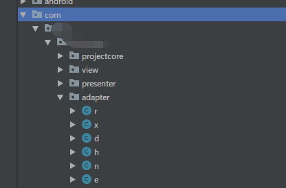

# 一个混淆后报NullPointerException的问题

最近的项目中需要集成一些扫描枪厂家的第三方SDK,前面都还算顺利,今天集成的这一家,开始也没有问题,但是开启了混淆后,会报NullPointerException,提示sdk包中的类找不到.问题比较少见,比较意外,多方尝试后才得到解决.背后的原理也还没有理清,记录备查.

## 问题表现

在一个有扫描功能的抽象类中,实例化一个sdk中的类,非常简单.

```kotlin
scanManager = ScanManager()
```

混淆过后,该行代码报NullPointerException.显然是ScanManager()报的.在這里断点,进来以后一执行ScanManager()就报错了.关闭混淆的情况下,则可以成功构造出实例.

## 尝试解决

1. 首先当然是添加这个jar包的,混淆保持策略,整个包保存,这个sdk的包名,不是很常见,用的是安卓系统类型的包名:`android.device.ScanManager`,`android.device.DeviceManager`这种.在:app的proguard-rules.pro中添加:

   ```
   -keep class android.device.** { *; }
   ```

   keep整个包不被混淆,跑起来问题还是一样.
   
2. 怀疑是混淆策略没有起效,这个包内的类还是被混淆了,手动拖入混淆后的apk到as中,查看dex结构.发现:

   

   目标包并没有被混淆,

   

   我自己的类已经混淆成功了.同事尝试keep 调用ScanManager的类的所有代码也无效.问题依旧.

3. 还有很多其他的尝试,keep ScanManager到mainDex等,最后都没有效果.

## 解决

虽然最终也没有搞清楚是什么原因引起的,但是经过上面的分析,我确定混淆规则确实是起效了的,ScanManager并没有被混淆,可能是因为比较特殊的包名,在读取这个class的时候,classLoader没有找到,或则不被支持等问题.这个也是臆测,要是class没有找到难道不应该报*ClassNotFoundException*么?反正最后也没能搞清楚原因.但是说到了classLoader就想起了Tinker热修复实现原理中,让classLoader提前找到要修复的类返回的操作.那么這里是不是因为classLoader没有找到ScanManager或者是找的过程中出现了什么问题呢?修改ScanManager初始化代码如下:

```kotlin
scanManager = Class.forName("android.device.ScanManager",true,classLoader).newInstance() as ScanManager?
```

其实也没有深入到classLoader的具体使用,只是简单的用反射创建新实例.相当意外的.问题得到了解决,开启混淆后,這里也不会报错了,感觉还是类加载过程中出现的问题.具体是为什么呢?//todo 2019-7-29 16:25:07

