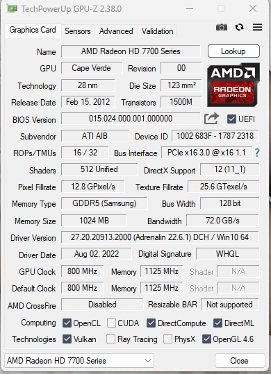

# 不支持UEFI的老显卡修改vBIOS进行支持

  前段时间要在办公室玩恐怖黎明,但是联想自带的GT730实在是有点慢,后来闲鱼收了一张HD7750,虽然也是老掉牙,但是性能也有3成提升,聊胜于无吧.但是存在HD7750不支持UEFI的问题.具体表现为:

 系统是win11未进系统时,什么都不显示,不能进BIOS.刚换卡未装驱动的时候,即使已经进入系统,仍然什么都不显示.开始还以为显卡是坏的.但是小键盘灯是可以相应的.后来用远程连到电脑上,才发现确实已经进入系统了,通过远程安装AMD的显卡驱动后,可以正常驱动,但是开机,重启未进入系统的时候还是什么都不显示.用GPU-Z看显卡参数,UEFI是没有打钩的.虽然也能将就着用,但是比较糟心,要是后面遇到问题需要进BIOS,就麻烦了,导致GT730我都不敢卖掉.

  爽玩了几天游戏以后,决定看看能不能解决这个问题,先在https://www.techpowerup.com/上找HD7750的显卡BIOS,有些是迪兰的有些不是,网上也说非同品牌的显卡BIOS不能混刷,作罢.

  后来在B站找到一些视频说,这种情况需要打开电脑BIOS里面的CSM支持,但是也需要先找其他支持UEFI的显卡进电脑BIOS去操作,我也不确定我的联想品牌机是否有CSM的选项,而且用这种方式假如主板电池掉电的话,还需要重新进行设置,颇为麻烦,结果是评论区看到有人说可以用一个批处理,修改显卡BIOS添加UEFI的支持,但是他又不说是什么,好不容易找了一会儿,还是给我找到了.

  参考的文章是[AMD显卡更新UEFI GOP_amd and nvidia gop update-CSDN博客](https://blog.csdn.net/zhangliang19950813/article/details/120283475),用的软件就是[GOP_Updater_v1.9.6.5.k_mod_v0.5.2](https://edef5.pcloud.com/cBZN3X39RZA5l3ChZZZzq17XkZ2ZZkUJZkZeQQ6Z2FZkVZdkZLXZ0XZe7Z2XZJVZiZ1ZyXZO7ZnXZHVZUzB8ZrsgduIa27mVQfF42ndb9obPlNGf7/GOP_Updater_v1.9.6.5.k_mod_v0.5.2.zip),我的显卡是HD7750找了几个版本的显卡BIOS刷新工具,后面成功的是[atiflash_284](https://uk1-dl.techpowerup.com/files/sAyyIR-lJ58p5HPOiIFBAQ/1731094408/atiflash_284.zip).按照操作步骤.

1. 先用GPU-Z保存现有的显卡BIOS文件,
2. 拖入GOPupd.bat中,添加UFEI支持,生成新的显卡bios文件.
3. 用atiflash刷入就好了.

刷入后需要重启,这个时候已经做好了变砖的准备,结果一发入魂,一重启久违的重启界面就出现了,进入系统后,用GPU-Z查看,UEFI支持的√也打上了.

至此完美解决.感谢分享经验和软件的大佬们.