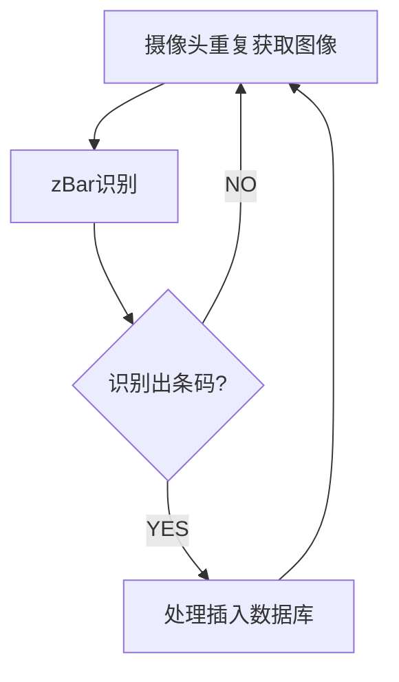

# 关于zBar部分手机扫描空白处识别出条码的问题

  最近的项目中使用到自己编译的zBar进行条码识别,在自己的手机上一直都没有问题,但是前面有一部小米MAX2s中出现了手机放着不动扫描空白处,尽然识别出了条码的bug.因为这个bug在别的手机上还没有遇到过,而且也比较诡异,未做处理,但是最近反馈说這样的手机也有一些包括小米8.必须要进行处理了.

## 识别流程



在摄像头重复的回调中,把图像数据交给zBar去识别,zBar返回识别到的条码list,如果list不空,则触发我的处理逻辑,正常情况下扫描空白的桌面,摄像头的回调图像也是空白的,传入zBar也肯定不会识别出条码信息了,但是却偏偏识别出了条码,匪夷所思了,zBar的底层识别是用c++实现的,虽然是[自己编译的zBar](https://download.csdn.net/download/longforus/11235111)也有源码在手,问题是看不懂啊.搜索能找到少量的类似问题,但是都没有解决方法.

## 解决过程

1. 先在出现问题的手机上安装了,zBar的官方demo,没有做什么修改,我的项目就是依据这个demo来进行配置的.问题依旧.那可以明确问题是在zBar的内部了.这个就触及到我的盲区了.
2. clone别的大神整合的扫描库[zBarLibary](https://github.com/bertsir/zBarLibary),构建后安装到问题手机发现问题没有再出现了,查看这个大神的条码识别也是使用的zBar,为什么我的不可以呢?
3. 直接替换项目中的so库为[zBarLibary](https://github.com/bertsir/zBarLibary)的so库,因为源码不一致,启动报错.
4. 观察[zBarLibary](https://github.com/bertsir/zBarLibary)的识别配置,修改自己项目的配置和[zBarLibary](https://github.com/bertsir/zBarLibary)的相同,成功.

## 之前的配置

只是copy官方demo,没有做更多的配置

```kotlin
 scanner.setConfig(0, Config.X_DENSITY, 3)
 scanner.setConfig(0, Config.Y_DENSITY, 3)
```

## 现在的配置

加上了条码识别的一些配置

```kotlin
  scanner.setConfig(0, Config.X_DENSITY, 3)
  scanner.setConfig(0, Config.Y_DENSITY, 3)
  scanner.setConfig(Symbol.NONE, Config.ENABLE, 0)
  scanner.setConfig(Symbol.CODE128, Config.ENABLE, 1)
  scanner.setConfig(Symbol.CODE39, Config.ENABLE, 1)
  scanner.setConfig(Symbol.EAN13, Config.ENABLE, 1)
  scanner.setConfig(Symbol.EAN8, Config.ENABLE, 1)
  scanner.setConfig(Symbol.UPCA, Config.ENABLE, 1)
  scanner.setConfig(Symbol.UPCE, Config.ENABLE, 1)
  scanner.setConfig(Symbol.UPCE, Config.ENABLE, 1)
```


感谢[zBarLibary](https://github.com/bertsir/zBarLibary)开源库,如果有扫描需求的话可以直接使用,因为我没有二维码需求,就保持现在的不变了.