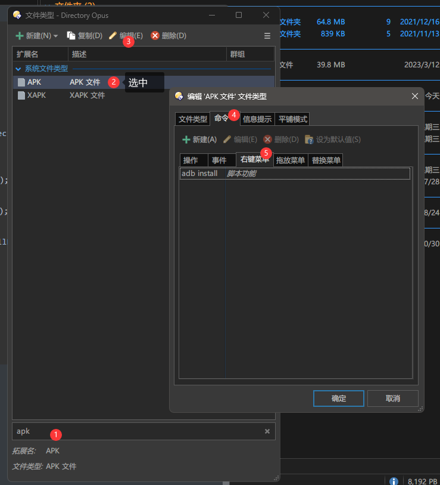
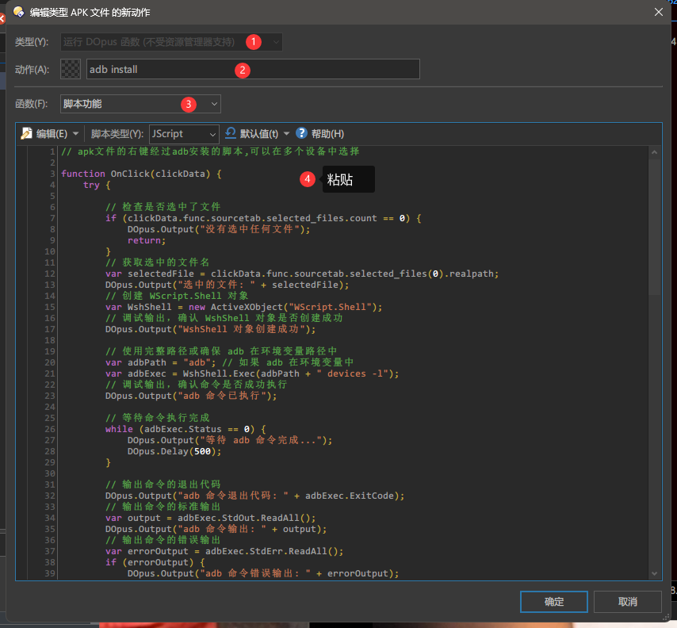
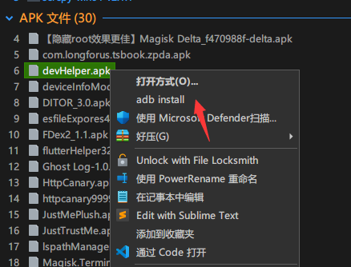
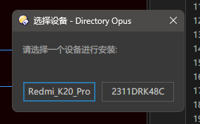

# 双击安装Apk,可选目标设备的小脚本

在逆向或者开发的时候经常需要安装Apk到设备,一般都用`adb install z:/xxx.apk`进行安装,如果adb只连了一个设备还好,要是多连了几个就麻烦了,需要`adb -s 设备号 install z:/xxx.apk`来进行安装,设备号或者是`IP:端口`还一长串,要么直接手输,要么先`adb devices`进行复制,非常的不方便.有了这个小脚本就方便了,如果只连了一个设备双击就可以直接安装,如果有多个设备则只需要多输入一个代表index的数字就可以了,还是很方便的.

## 环境

- win11
- Git
- adb

## 脚本

### apkInstall.sh

```shell
# source ~/.bash_profile
echo "$1"
cmdRes1=`adb devices -l`
array=(${cmdRes1//n/ })  #用\n来分开
index=1
dev="device"
da=()
dArrayIndex=0
for var in ${array[@]}
do
   if [ "$var" == "$dev" ];then
        da[dArrayIndex]=${array[index-2]} #找到设备号
        # echo "[ =${da[dArrayIndex]}=  $index   $dArrayIndex ]"
        let dArrayIndex+=1
   fi
   let index+=1
done
run=""

if [ -n "${da[1]}" ];then
       echo "***************** has more than one device ****************"
       for var in ${da[@]}
        do
        echo $var
        done
    echo "************* input index select target device **************"
    read -p "input index to install or enter install to device 0 : " target
    echo -e "\n"
    if [ -n "${target}" ];then
        if [ ${target} -gt 0 ] 2>/dev/null ;then 
            if [ ${target} -gt ${dArrayIndex} ];then
                echo "$target out of range!!!    wow~ ⊙o⊙"
                target=0
            fi
        else 
            echo "input is not number!!!   O__O \"…"
            target=0
        fi 
       echo -e "(((((((((((っ･ω･)っ Σ(σ｀･ω･´)σ 起飞！ start install to ${da[target]}\n"
       run=`adb -s ${da[target]} install -r $1`
    else
        echo -e "(((((((((((っ･ω･)っ Σ(σ｀･ω･´)σ 起飞！ start install to ${da[0]}\n"
        run=`adb -s ${da[0]} install -r $1`
    fi
else
    echo -e "(((((((((((っ･ω･)っ Σ(σ｀･ω･´)σ 起飞！ start install to only device :  ${da[0]}\n"
    run=`adb install -r $1`
fi
echo -e "$run \n"
echo -e "(^・ω・^ )( ^・ω・^)Install Complete(^・ω・^ )( ^・ω・^)"
```

### adbInstall.bat

win上如果直接使用.sh脚本作为apk的默认打开方式的话,会提示此应用无法在你的电脑上运行.所以需要一个额外的.bat文件来启动.linux和mac的话是不需要的,但是我工作电脑是win,这2个系统就没有测试了,按道理来说,顶多改改就能用.

```bat
C:\Git\git-bash.exe D:\MyDocuments\Desktop\apkInstall.sh %1
```

## 使用

右击apk文件,`打开方式`->`选择其他应用`,`更多应用`->`在这台电脑上选择其他应用`,找到`adbInstall.bat`打开,并勾选`始终使用此应用打开.apk文件`.就大功告成了.

以后使用直接双击apk文件即可.


会列出已经连接adb的设备,直接回车|输入0|输入不合法,都会安装到默认的第0个设备上,输入1则会安装到第1个设备上,非常的简单方便.


完了.

2024年6月7日 18:41:06更新 Directory Opus 13.6 可用的apk文件右键菜单脚本:

```js
// apk文件的右键经过adb安装的脚本,可以在多个设备中选择

function OnClick(clickData) {
    try {
      
 		// 检查是否选中了文件
        if (clickData.func.sourcetab.selected_files.count == 0) {
            DOpus.Output("没有选中任何文件");
            return;
        }
        // 获取选中的文件名
        var selectedFile = clickData.func.sourcetab.selected_files(0).realpath;
        DOpus.Output("选中的文件: " + selectedFile);
        // 创建 WScript.Shell 对象
        var WshShell = new ActiveXObject("WScript.Shell");
        // 调试输出，确认 WshShell 对象是否创建成功
        DOpus.Output("WshShell 对象创建成功");

        // 使用完整路径或确保 adb 在环境变量路径中
        var adbPath = "adb"; // 如果 adb 在环境变量中
        var adbExec = WshShell.Exec(adbPath + " devices -l");
        // 调试输出，确认命令是否成功执行
        DOpus.Output("adb 命令已执行");

        // 等待命令执行完成
        while (adbExec.Status == 0) {
            DOpus.Output("等待 adb 命令完成...");
            DOpus.Delay(500);
        }

        // 输出命令的退出代码
        DOpus.Output("adb 命令退出代码: " + adbExec.ExitCode);
        // 输出命令的标准输出
        var output = adbExec.StdOut.ReadAll();
        DOpus.Output("adb 命令输出: " + output);
        // 输出命令的错误输出
        var errorOutput = adbExec.StdErr.ReadAll();
        if (errorOutput) {
            DOpus.Output("adb 命令错误输出: " + errorOutput);
        }

        // 解析 adb 命令的输出，提取设备信息
        var deviceList = [];
        var lines = output.split('\n');
        for (var i = 1; i < lines.length; i++) {
            var line = lines[i];
            if (line) {
                var parts = line.split(/\s+/);
                if (parts.length > 2) {
                    var deviceId = parts[0];
                    var model = "";
                    for (var j = 0; j < parts.length; j++) {
                        if (parts[j].indexOf("model:") === 0) {
                            model = parts[j].split(':')[1];
                            break;
                        }
                    }
					DOpus.Output("deviceId "+deviceId+" model  "+model);
                    deviceList.push({id: deviceId, model: model});
                }
            }
        }
        // 如果没有设备，输出提示信息
        if (deviceList.length === 0) {
            DOpus.Output("没有检测到设备"+deviceList);
            return;
        }

        // 创建选择对话框
        var dlg = clickData.func.dlg;
        dlg.title = "选择设备";
        dlg.message = "请选择一个设备进行安装:";
        var buttons = "";
       for (var k = deviceList.length - 1; k >= 0; k--) {
            if (buttons.length > 0) {
                buttons += "|";
            }
            buttons += deviceList[k].model;
        }
        dlg.buttons = buttons;
        dlg.Show();

         var selectedIndex = dlg.result;
		 DOpus.Output("selectedIndex = "+selectedIndex);
        if (selectedIndex < 0) {
            DOpus.Output("用户未选择任何设备");
            return;
        }
        // 根据选择的索引获取设备ID
        var deviceId = deviceList[selectedIndex].id;
        // 执行 adb install 命令
        var apkPath = selectedFile; // 使用选中的 APK 文件路径
        var installCmd = adbPath + " -s " + deviceId + " install " + apkPath;
        DOpus.Output("执行命令: " + installCmd);
        var installExec = WshShell.Exec(installCmd);
        // 等待安装命令完成
        while (installExec.Status == 0) {
            DOpus.Output("等待 adb install 命令完成...");
            DOpus.Delay(500);
        }

        // 输出安装命令的退出代码
        DOpus.Output("adb install 命令退出代码: " + installExec.ExitCode);
         // 输出安装命令的标准输出
        var installOutput = installExec.StdOut.ReadAll();
        DOpus.Output("adb install 命令输出: " + installOutput);
        // 输出安装命令的错误输出
        var installErrorOutput = installExec.StdErr.ReadAll();
        if (installErrorOutput) {
            DOpus.Output("adb install 命令错误输出: " + installErrorOutput);
        }
    } catch (e) {
        // 捕获并输出错误信息
        DOpus.Output("发生错误: " + e.message);
    }
}

```

### 安装方法

1.  Directory Opus 13.6 设置->文件类型:

2. 搜索apk

    

3. 选择新建

    

### 使用





选择对应的设备就可以了,存在的问题是会弹出命令行的黑框.但是比输序号还是要方便,优雅一些