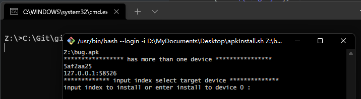

# 双击安装Apk,可选目标设备的小脚本

在逆向或者开发的时候经常需要安装Apk到设备,一般都用`adb install z:/xxx.apk`进行安装,如果adb只连了一个设备还好,要是多连了几个就麻烦了,需要`adb -s 设备号 install z:/xxx.apk`来进行安装,设备号或者是`IP:端口`还一长串,要么直接手输,要么先`adb devices`进行复制,非常的不方便.有了这个小脚本就方便了,如果只连了一个设备双击就可以直接安装,如果有多个设备则只需要多输入一个代表index的数字就可以了,还是很方便的.

## 环境

- win11
- Git
- adb

## 脚本

### apkInstall.sh

```shell
# source ~/.bash_profile
echo "$1"
cmdRes1=`adb devices -l`
array=(${cmdRes1//n/ })  #用\n来分开
index=1
dev="device"
da=()
dArrayIndex=0
for var in ${array[@]}
do
   if [ "$var" == "$dev" ];then
        da[dArrayIndex]=${array[index-2]} #找到设备号
        # echo "[ =${da[dArrayIndex]}=  $index   $dArrayIndex ]"
        let dArrayIndex+=1
   fi
   let index+=1
done
run=""

if [ -n "${da[1]}" ];then
       echo "***************** has more than one device ****************"
       for var in ${da[@]}
        do
        echo $var
        done
    echo "************* input index select target device **************"
    read -p "input index to install or enter install to device 0 : " target
    echo -e "\n"
    if [ -n "${target}" ];then
        if [ ${target} -gt 0 ] 2>/dev/null ;then 
            if [ ${target} -gt ${dArrayIndex} ];then
                echo "$target out of range!!!    wow~ ⊙o⊙"
                target=0
            fi
        else 
            echo "input is not number!!!   O__O \"…"
            target=0
        fi 
       echo -e "(((((((((((っ･ω･)っ Σ(σ｀･ω･´)σ 起飞！ start install to ${da[target]}\n"
       run=`adb -s ${da[target]} install -r $1`
    else
        echo -e "(((((((((((っ･ω･)っ Σ(σ｀･ω･´)σ 起飞！ start install to ${da[0]}\n"
        run=`adb -s ${da[0]} install -r $1`
    fi
else
    echo -e "(((((((((((っ･ω･)っ Σ(σ｀･ω･´)σ 起飞！ start install to only device :  ${da[0]}\n"
    run=`adb install -r $1`
fi
echo -e "$run \n"
echo -e "(^・ω・^ )( ^・ω・^)Install Complete(^・ω・^ )( ^・ω・^)"
```

### adbInstall.bat

win上如果直接使用.sh脚本作为apk的默认打开方式的话,会提示此应用无法在你的电脑上运行.所以需要一个额外的.bat文件来启动.linux和mac的话是不需要的,但是我工作电脑是win,这2个系统就没有测试了,按道理来说,顶多改改就能用.

```bat
C:\Git\git-bash.exe D:\MyDocuments\Desktop\apkInstall.sh %1
```

## 使用

右击apk文件,`打开方式`->`选择其他应用`,`更多应用`->`在这台电脑上选择其他应用`,找到`adbInstall.bat`打开,并勾选`始终使用此应用打开.apk文件`.就大功告成了.

以后使用直接双击apk文件即可.



会列出已经连接adb的设备,直接回车|输入0|输入不合法,都会安装到默认的第0个设备上,输入1则会安装到第1个设备上,非常的简单方便.


完了.