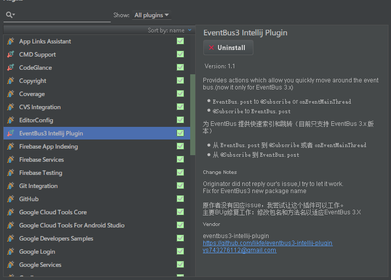
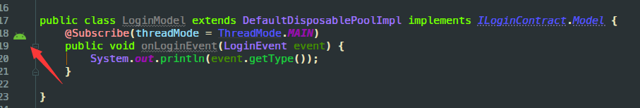
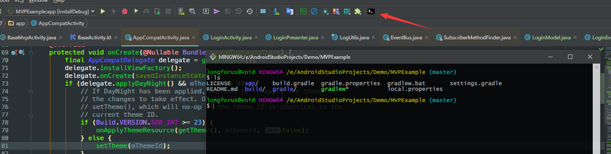

# 安卓开发常用插件推荐

##前言

​	现在的安卓码农们，基本上都已经把锄头换成Android Studio了吧，Android Studio是基于Jetbrains 的IntelliJ IDEA开发的。 继承了Jetbrains全家桶系列的优良风格:智能，强大，界面美观。。。我刚刚从Eclipse转到IDEA的时候还很不习惯，但是为了这个颜值，还是坚持了下来，后来推出了Android Studio，立马就无缝上手了。和Eclipse一样IntelliJ IDEA也具有很强的开放性。除了Community Edition还提供了Platform SDK，让用户可以根据自己的需求开发一些插件，提高搬砖的效率。今天我就介绍一下我自己使用的几款插件。

## MvpAutoCodePlus


​	我先抛砖引玉，厚着脸皮给自己开发的这个插件打一波广告。自从开始使用MVP架构开发以来，有一个问题让我比较苦恼，就是开发一个功能页面。比如说Login页面，分别需要新建ILoginView，ILoginPresenter，ILoginModel这样的三个接口，还要创建LoginActivity，LoginPresenter，LoginModel三个实现类，MVP接口还需要继承自父接口，还带有多个泛型，这一波搞下来，既浪费时间，又繁杂。我就在想有没有什么方式能快速生成这些代码，减少重复的无意义工作呢？答案当然是插件，在插件仓库中尝试了一些Mvp代码生成的插件后，感觉效果不是很理想。有的功能比较单一，有的是按照作者自己的编码习惯来开发的，遗憾的是不适用于我现在的开发方式。那时候就想要是可以自己按自己的习惯实现一个就好了。但是一直都没有行动起来，一是工作比较忙，二是对插件开发这方面是完全陌生的。最近项目不是很忙，上周和朋友闲聊，说到插件，就想起这个事情来。感觉是时候去尝试一下了。说干就干，先从[官方文档](http://www.jetbrains.org/intellij/sdk/docs/welcome.html)入手，结合我下面将要介绍的一些优秀开源插件的源码。从hello world开始一步一步，历时10天。初步完成了这个符合我Mvp模版代码生成插件。很不完美，但是初步可用。比起其他轮子可能在我的车上会更稳一点点。今天不做插件开发教学，这一点点皮毛是绝对不敢班门弄斧的.我的意思是没去做未必知道不行,做过了才知道.

### 功能特性

- 基于指定的父接口,父类生成MvpContract接口和对应的实现类,并添加抽象方法默认实现
- View的实现类支持Activity和Fragment
- 实现类的父类支持多个备选
- 支持Java和Kotlin代码

### 插件首页

https://github.com/longforus/MvpAutoCodePlus

欢迎大家下载尝试,star,issue.代码很粗浅,如果不是很符合你的需求,也可以下载源码进行个性化定制.

##Eventbus3 Intellij Plugin



EventBus是大家在开发中经常使用到的一个工具,基于观察者模式在任意位置发送事件,在任意位置订阅接收.用起来是非常的方便.但是我还是在事件传递确实不方便的时候才会使用,因为如果使用量大了以后,各种事件到处乱飞,不容易找到事件的发送处和接收处.原来我都是 选中Event类型 Find Usages 然后在结果中查找,再双击跳到对应的位置.但是有了这个插件以后,找起来就方便多了.

### 使用方法

安装好插件以后,重启Android Studio,在事件发送行的前面会出现一个小图标,点击就会跳转到事件的订阅处,如果有多个订阅,则会列表显示.


而订阅处点击则会跳转到事件的发送处.


使用起来真的是非常的方便,妈妈再也不怕我迷路了.比较遗憾的是这个插件还没有支持Kotlin,在Kotlin代码中会失效.

说到這里我要吐槽一下一些童鞋的EventBus使用姿势,多种Event使用一个Event Class,里面使用tag来区分,如果了解过EventBus的源码的话,就会发现这种姿势的弊端.

```java
//EventBus内部维护了一个以Event的Class为key,订阅者信息列表为vlaue的Map
private final Map<Class<?>, CopyOnWriteArrayList<Subscription>> subscriptionsByEventType; 

	//  EventBus.getDefault().register(this); 会调用到这里
    private void subscribe(Object subscriber, SubscriberMethod subscriberMethod) {
        Class<?> eventType = subscriberMethod.eventType;
        Subscription newSubscription = new Subscription(subscriber, subscriberMethod);
        CopyOnWriteArrayList<Subscription> subscriptions = subscriptionsByEventType.get(eventType);
        if (subscriptions == null) {
            subscriptions = new CopyOnWriteArrayList<>();
            subscriptionsByEventType.put(eventType, subscriptions);
        } else {
            if (subscriptions.contains(newSubscription)) {
                throw new EventBusException("Subscriber " + subscriber.getClass() + " already registered to event "
                        + eventType);
            }
        }
		//会对subscriptionsByEventType的value List进行遍历,如果只使用一个Event类型,那么这个List会很长,遍历的时候会比较耗时一点,没有发挥出Map的优势,违反了作者的初衷.而且会调起其他同一Event类型的活动代码.
        int size = subscriptions.size();
        for (int i = 0; i <= size; i++) {
            if (i == size || subscriberMethod.priority > subscriptions.get(i).subscriberMethod.priority) {
                subscriptions.add(i, newSubscription);
                break;
            }
        }

        List<Class<?>> subscribedEvents = typesBySubscriber.get(subscriber);
        if (subscribedEvents == null) {
            subscribedEvents = new ArrayList<>();
            typesBySubscriber.put(subscriber, subscribedEvents);
        }
        subscribedEvents.add(eventType);
		......
    }
```

而且如此使用的话,这个插件的优势也不能完全发挥,我的个人建议是一个事件类型定义一个Event Class.

### 插件首页

https://github.com/likfe/eventbus3-intellij-plugin

## Alibaba Java Coding Guidelines


  去年阿里巴巴推出了Java代码规约后,又发布了这款规约扫描插件,用扫描的方式帮助我们发现代码中的潜在问题和不合规处.我在公司也推荐同事安装这个插件,虽然不可能完全按照它的规范走,但是尽量遵守,合作开发的过程中也会减少很多因规范而发生的问题.

### 使用方法

安装后,选中目标目录按图操作:


过一会扫描完成了:


扫描结果分为三个级别,Blocker的建议尽量修改,原因和解决方法大都会在右侧提示,部分问题还提供批量操作.Critical和Major的也应该尽量遵守.类似的插件还有FindBugs.

### 插件首页

https://github.com/alibaba/p3c

## CodeGlance


我把Sublime Text当默认记事本,右侧的代码预览滚动条是我的最爱,看着有逼格,跳转拖动也非常的方便,IDEA平台上有这个插件实现同样的功能.


装上瞬间高大上了三分有木有?一眼就能定位在当前文件中的大致位置,拖动也非常方便.

### 插件主页

https://github.com/Vektah/CodeGlance


## Native Terminal Plugin


去年做组件化和自定义自动打包以来,需要在服务器上根据前台用户配置再后台自动打出根据配置生成的apk.开发的时候就要经常在命令行中输入gradle命令进行打包测试.Android Studio 集成的终端在我修改了界面字体后字体就变得很丑了,用起来就不方便,这个时候就需要一个能快速在当前工程目录打开终端的工具,后台就找到了它.

### 使用方法

安装重启后,在工具栏会多出一个小图标,轻轻一点就能在当前工程目录下打开系统默认终端了,so easy.



还可以在Settings中修改为其他终端,相对于cmd和Powershell,我更喜欢git-bash.

### 插件首页

https://github.com/sburlyaev/IDEA-Native-Terminal-Plugin

## 插件的安装姿势

点击File> Preferences(Settings) > Plugins > 


左边是JetBrains的官方插件,中间是民间插件,搜索出来后点击安装,重启Android Studio就可使用了,还有非常非常多的优秀插件等待你来发掘哦.好了今天就讲这些,都是我在使用的插件,分享给大家希望有了這些插件的帮助,让你的操作如虎添翼.