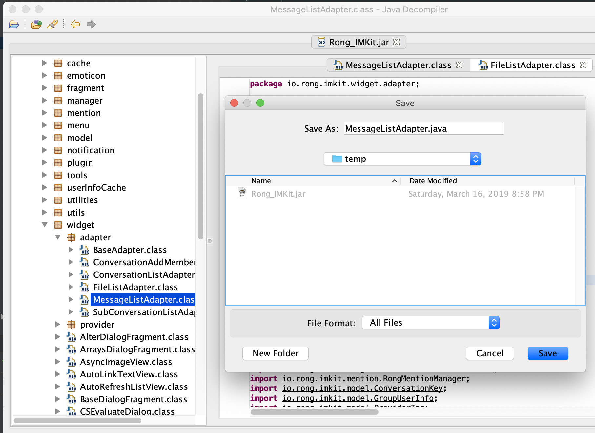
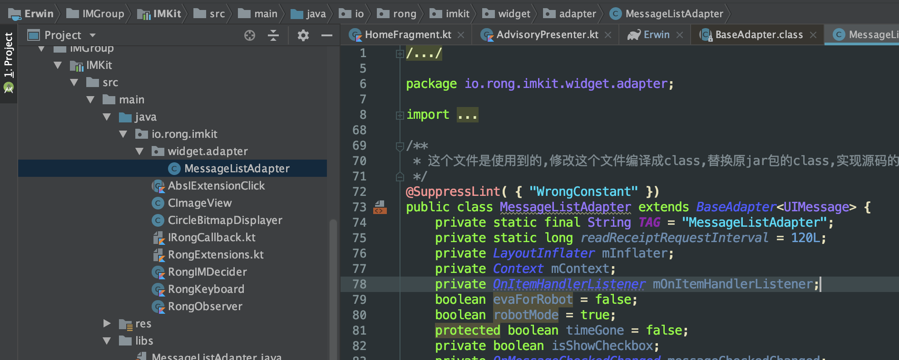

# 编辑jar包中class文件的几种方式

在日常的开发中经常使用到第三方一些库,这些库可能提供gradle仓库的依赖,也可能提供jar包,有时候为了我们的一些自定义操作,需要修改这些jar包中的代码.这个时候该怎么做呢?

## 我所了解的可以修改jar中class的几种方式

1. aop编程,使用aop框架hook想要修改的class的方法,自己实现这个方法或者额外的执行一些代码,但既然是aop,aop的目的也不是這样的,aop适合于面向切面的,多点修改的情况.虽然也能达到目的,但并不适合今天的场景.
2. 自定义gradle插件,继承`Transform`在里面找到要修改的class用`javassist`等工具修改对应的代码,这个也是aop实现的一种方式.也不适合今天的情况.
3. 使用[JD-GUI](http://java-decompiler.github.io/)这样的decompile工具,打开jar包中的class文件,另存为.java文件修改相应的代码后,重新编译替换原来jar包中的class文件.今天开始也采用這样的方法,但是发现了一些需要注意的点:

   1. 如果类中有匿名内部类,反编译出来的代码进行编辑的时候需要修改一些引用上的错误.这个问题应该是避免不了的.
   2. 重新编译需要对应的环境,原类在什么包中,编辑的类也需要在对应的包中,编辑的环境还需要依赖对应的jar包.不然是不能正常编译出class的.
   3. 编辑后编译生成的class文件,应该连生成的内部类全部替换,防止有一些没注意到的修改没有替换到.造成非预期情况的发生.
4. 这个方法和3类似,也是今天使用的方法.还是使用JD-GUI,decompile另存为.java文件,然后在as中创建对应的包,copy .java文件到其中进行编辑,這样的好处是修改方便,和正常的修改代码一样.修改完成后不再拷贝生成的class文件到jar包中,因为最后这些class文件都会合并到一处,最近打包成dex,拷不拷贝都一样.

## 今天使用的方法的大概流程

### 另存为.java文件

下载安装[JD-GUI](http://java-decompiler.github.io/),打开需要修改的jar包,找到想要修改的class文件, `Ctrl+s`保存为.java文件.

### 拷贝到项目中修改

建立对应的包,拷贝到包中修改,这个module需要依赖这个jar包.

### 合并处理

修改完成后直接assemble的话是会报错的,因为jar包中有和这个.java文件编译生成的同名class文件.有几种处理方式:

1. 删除jar包中这个类的class,包括内部类的class哦,这个最简单粗暴.

2. 实现gradle插件在`Transform`中过滤掉对应的类不拷贝,没有进行尝试,感觉是可以实现的.但是有点舍近求远的意思.

3. 另外开始想不依赖这个jar包,直接把jar中的class解压到class目录下,解压的过程中,过滤掉不要的class,debug模式下已经实现,但是release的时候报找不到要依赖的类,这个方法目前有2个点还需要明确.

   1. 如何在JavaCompile的时候获取这次编译的buildType.如果可以获取到,在release的时候就把jar解压到对应的目录下,這样还会报找不到类么?
   2. 怎么让model依赖一个目录中的class?

   如果可以解决这2个问题之一应该可以让这个方案得以实现,假如在不允许修改jar的情况下,这种方法就有作用了.

现在还是使用的方法1来实现,其他的方法待测试.